<div align="center">

# 💰 Shosha Finance

### Distributed Offline-First Finance System for Multi-Branch Operations

[](https://go.dev/)
[](https://reactjs.org/)
[](https://www.electronjs.org/)
[](https://www.typescriptlang.org/)
[](https://gofiber.io/)
[](https://www.sqlite.org/)
[](https://www.postgresql.org/)
[](https://www.docker.com/)
[](LICENSE)

<p align="center">
  
  
  
</p>

[Features](#-features) • [Architecture](#-architecture) • [Installation](#-installation) • [Usage](#-usage) • [Testing](#-testing) • [Contributing](#-contributing)

</div>

---

## 📖 About

**Shosha Finance** is a powerful **offline-first** desktop financial management system designed for multi-branch operations. Built with the **Electron Sidecar Pattern**, it ensures 100% functionality without internet connectivity while providing automatic background synchronization to a central cloud server when online.

### 🎯 Key Highlights

- 🔌 **100% Offline Capable** - Works without internet connection
- 🔄 **Auto Background Sync** - Syncs data automatically when online
- 🏢 **Multi-Branch Support** - Centralized cloud with distributed local branches
- 🔐 **Secure Authentication** - JWT-based with role management
- 📊 **Real-time Dashboard** - Live financial summaries and charts
- 🎨 **Modern UI** - Built with React + Shadcn/UI + Tailwind CSS
- ⚡ **High Performance** - Go backend with Fiber framework
- 🗄️ **Dual Database** - SQLite (local) + PostgreSQL (cloud)

---

## ✨ Features

### 🔐 Authentication & User Management
- JWT-based secure authentication
- Role-based access control (Admin, Manager, Staff)
- Auto-generated default users
- Protected routes and middleware

### 💸 Transaction Management
- Create income/expense transactions
- View all transactions with pagination
- Detailed transaction view
- Customizable categories
- High-precision amount handling (integer-based)

### 📊 Dashboard & Analytics
- Real-time financial summary
- Total income, expense, and balance
- Interactive bar charts
- Category-based breakdowns

### 🔄 Automatic Synchronization
- Background worker for auto-sync
- Configurable sync interval (default: 30s)
- Smart conflict resolution with UUID
- Offline queue management
- Status indicators (Online/Offline)

### 🏗️ Architecture Features
- **Clean Architecture** pattern
- Repository-Service-Handler layers
- Dependency injection
- Structured logging with Zerolog
- CORS & JWT middleware
- Docker containerization ready

---

## 🏛️ Architecture



```mermaid
graph TB
    subgraph "Local Branch (Offline Capable)"
        FE[React Frontend<br/>Electron Renderer]
        LB[Go Local Backend<br/>Port 8080]
        LDB[(SQLite Database)]
        SW[Sync Worker<br/>Background Process]
        
        FE -->|HTTP JSON| LB
        LB -->|SQL Queries| LDB
        LB -->|Goroutine| SW
    end
    
    subgraph "Cloud Server (Dockerized)"
        CB[Go Cloud Backend<br/>Port 3000]
        CDB[(PostgreSQL Database)]
        
        CB -->|SQL Queries| CDB
    end
    
    SW -.->|Auto Sync<br/>Every 30s| CB
    
    style FE fill:#61dafb,stroke:#333,stroke-width:2px
    style LB fill:#00add8,stroke:#333,stroke-width:2px
    style CB fill:#00add8,stroke:#333,stroke-width:2px
    style LDB fill:#003b57,stroke:#333,stroke-width:2px
    style CDB fill:#4169e1,stroke:#333,stroke-width:2px
    style SW fill:#ff6b6b,stroke:#333,stroke-width:2px
```

### Technology Stack

| Layer | Technology | Purpose |
|-------|-----------|---------|
| **Frontend** | React 18 + TypeScript + Vite | UI Framework |
| **Desktop Runtime** | Electron | Cross-platform desktop app |
| **UI Components** | Shadcn/UI + Tailwind CSS | Modern component library |
| **State Management** | TanStack Query (React Query) | Data fetching & caching |
| **Charts** | Recharts | Data visualization |
| **Backend** | Go 1.22 + Fiber v2 | High-performance API |
| **ORM** | GORM | Database abstraction |
| **Local Database** | SQLite 3 | File-based local storage |
| **Cloud Database** | PostgreSQL 15 | Centralized cloud storage |
| **Authentication** | JWT (golang-jwt/jwt) | Secure token-based auth |
| **Logging** | Zerolog | Structured logging |
| **Containerization** | Docker + Docker Compose | Cloud deployment |

---

## 💻 Installation

### Prerequisites

Before you begin, ensure you have the following installed:

- **Node.js** v18 or higher ([Download](https://nodejs.org/))
- **Go** v1.22 or higher ([Download](https://go.dev/dl/))
- **Docker** & **Docker Compose** (for cloud server) ([Download](https://www.docker.com/))
- **Git** ([Download](https://git-scm.com/))

### 📥 Clone Repository

```bash
git clone https://github.com/FuncSmile/shosha_finance.git
cd shosha_finance
```

---

## 🚀 Quick Start

### Option 1: Development Mode (Recommended)

#### 🌐 Online Mode (with Cloud Sync)

**Terminal 1 - Start Cloud Server:**
```bash
cd /home/fad/Documents/myProject/shosha/shosha_desktop
make dev-cloud
```

**Terminal 2 - Start Frontend:**
```bash
cd /home/fad/Documents/myProject/shosha/shosha_desktop
make dev-frontend
```

#### 📴 Offline Mode (Local Only)

```bash
cd /home/fad/Documents/myProject/shosha/shosha_desktop
make dev-offline
```

### Option 2: Production Build

Build executable for your platform:

```bash
cd frontend

# Windows
npm run build:win

# macOS
npm run build:mac

# Linux
npm run build:linux
```

---

## 🖥️ Platform-Specific Instructions

###  Windows

#### Setup Backend

```powershell
# 1. Navigate to backend directory
cd backend

# 2. Copy environment template
copy .env.local.example .env.local

# 3. Edit .env.local with your configuration
notepad .env.local

# 4. Install Go dependencies
go mod download

# 5. Build and run local backend
go run cmd/local/main.go
```

#### Setup Frontend

```powershell
# 1. Navigate to frontend directory
cd frontend

# 2. Install Node dependencies
npm install

# 3. Run in development mode
npm run dev

# 4. Build Windows executable
npm run build:win
```

**Output:** Executable will be in `frontend/dist/win-unpacked/`

---

###  macOS

#### Setup Backend

```bash
# 1. Navigate to backend directory
cd backend

# 2. Copy environment template
cp .env.local.example .env.local

# 3. Edit .env.local with your configuration
nano .env.local
# Or use your preferred editor: vim, code, etc.

# 4. Install Go dependencies
go mod download

# 5. Build and run local backend
go run cmd/local/main.go
```

#### Setup Frontend

```bash
# 1. Navigate to frontend directory
cd frontend

# 2. Install Node dependencies
npm install

# 3. Run in development mode
npm run dev

# 4. Build macOS app
npm run build:mac
```

**Output:** App will be in `frontend/dist/mac/`

**Note:** You may need to allow the app in System Preferences > Security & Privacy

---

###  Linux

#### Setup Backend

```bash
# 1. Navigate to backend directory
cd backend

# 2. Copy environment template
cp .env.local.example .env.local

# 3. Edit .env.local with your configuration
nano .env.local
# Or: vim .env.local

# 4. Install Go dependencies
go mod download

# 5. Build and run local backend
go run cmd/local/main.go
```

#### Setup Frontend

```bash
# 1. Navigate to frontend directory
cd frontend

# 2. Install Node dependencies
npm install

# 3. Run in development mode
npm run dev

# 4. Build Linux AppImage/deb
npm run build:linux
```

**Output:** Binary will be in `frontend/dist/`

**Make it executable:**
```bash
chmod +x frontend/dist/shosha-finance-*.AppImage
```

---

## ⚙️ Configuration

### Local Backend Configuration

Edit `backend/.env.local`:

```bash
# Application Mode
APP_MODE=local

# Server Port
PORT=8080

# SQLite Database Path
SQLITE_PATH=./shosha_finance.db

# Cloud API Configuration
CLOUD_API_URL=http://localhost:3000
BRANCH_API_KEY=your-branch-api-key-here
BRANCH_ID=your-branch-uuid-here

# Sync Settings
SYNC_INTERVAL=30  # seconds

# JWT Secret
JWT_SECRET=your-super-secret-jwt-key-change-in-production
```

### Cloud Backend Configuration

Edit `backend/.env.cloud`:

```bash
# Application Mode
APP_MODE=cloud

# Server Port
PORT=3000

# PostgreSQL Configuration
DB_HOST=postgres_db
DB_PORT=5432
DB_USER=postgres
DB_PASS=your-secure-password
DB_NAME=shosha_finance
```

### Docker Compose Configuration

Edit `.env` in root directory:

```bash
DB_USER=postgres
DB_PASS=your-secure-password
```

---

## 🧪 Testing Guide

### Test Online Mode (2 Terminals)

**Terminal 1 - Cloud API:**
```bash
cd /home/fad/Documents/myProject/shosha/shosha_desktop
make dev-cloud
```

**Terminal 2 - Frontend:**
```bash
cd /home/fad/Documents/myProject/shosha/shosha_desktop
make dev-frontend
```

**Expected Results:**
- ✅ Sidebar displays **"Online"** (green indicator)
- ✅ Data syncs to cloud every 30 seconds
- ✅ "Unsynced" count = 0 after successful sync

---

### Test Offline Mode (1 Terminal)

```bash
cd /home/fad/Documents/myProject/shosha/shosha_desktop
make dev-offline
```

**Expected Results:**
- ✅ Sidebar displays **"Offline"** (yellow indicator)
- ✅ Data saved locally only
- ✅ "Unsynced" count increases when adding transactions

---

### Test Reconnection

1. Run `make dev-offline` → add several transactions → see "unsynced" count increase
2. Stop application (`Ctrl+C`)
3. Run `make dev-cloud` in terminal 1
4. Run `make dev-frontend` in terminal 2
5. Watch status change to **"Online"** and data auto-sync

---

## 📝 Available Commands

### Root Directory Commands

| Command | Description |
|---------|-------------|
| `make dev-cloud` | Start cloud API server (port 3000) |
| `make dev-frontend` | Start frontend in online mode |
| `make dev-offline` | Start frontend in offline mode |
| `make clean` | Remove all databases |

### Backend Commands

```bash
cd backend

# Install dependencies
make deps

# Build local backend
make build-local

# Build cloud backend
make build-cloud

# Run local backend (development)
make run-local

# Run cloud backend (development)
make run-cloud

# Run tests
make test

# Run linter
make lint

# Clean build artifacts
make clean
```

### Frontend Commands

```bash
cd frontend

# Install dependencies
npm install

# Development mode
npm run dev

# Build for production
npm run build

# Preview production build
npm run preview

# Type checking
npm run typecheck

# Lint code
npm run lint

# Build Windows executable
npm run build:win

# Build macOS app
npm run build:mac

# Build Linux AppImage
npm run build:linux
```

---

## 🔐 Default Login Credentials

| Username | Password | Role | Description |
|----------|----------|------|-------------|
| `admin` | `admin123` | Admin | System administrator |
| `adminShosha` | `password123*` | Admin | Branch admin |
| `adminCabang` | `password123*` | Admin | Branch admin |
| `officialShosha` | `password123*` | Manager | Branch manager |
| `officialCabang` | `password123*` | Manager | Branch manager |

**⚠️ Important:** Change these credentials in production!

---

## 🗂️ Project Structure

```
shosha_desktop/
├── backend/                    # Go backend application
│   ├── cmd/
│   │   ├── cloud/             # Cloud server entry point
│   │   │   └── main.go
│   │   └── local/             # Local server entry point
│   │       └── main.go
│   ├── internal/
│   │   ├── config/            # Configuration management
│   │   ├── database/          # Database connection & migration
│   │   ├── handler/           # HTTP handlers (controllers)
│   │   │   ├── auth_handler.go
│   │   │   ├── dashboard_handler.go
│   │   │   ├── sync_handler.go
│   │   │   ├── system_handler.go
│   │   │   └── transaction_handler.go
│   │   ├── middleware/        # HTTP middleware
│   │   │   ├── auth.go
│   │   │   ├── cors.go
│   │   │   └── jwt_auth.go
│   │   ├── models/            # Data models
│   │   │   ├── branch.go
│   │   │   ├── transaction.go
│   │   │   └── user.go
│   │   ├── repository/        # Database layer
│   │   │   ├── branch_repository.go
│   │   │   ├── transaction_repository.go
│   │   │   └── user_repository.go
│   │   ├── response/          # API response formatting
│   │   ├── service/           # Business logic
│   │   │   ├── auth_service.go
│   │   │   ├── branch_service.go
│   │   │   └── transaction_service.go
│   │   └── worker/            # Background workers
│   │       └── sync_worker.go
│   ├── pkg/                   # Public packages
│   │   └── utils/
│   ├── Dockerfile
│   ├── Makefile
│   ├── go.mod
│   └── go.sum
│
├── frontend/                   # Electron + React application
│   ├── electron/              # Electron main process
│   ├── src/
│   │   ├── main/              # Electron main entry
│   │   ├── preload/           # Preload scripts
│   │   └── renderer/          # React application
│   │       └── src/
│   │           ├── api/       # API client
│   │           │   ├── auth.ts
│   │           │   ├── client.ts
│   │           │   ├── dashboard.ts
│   │           │   └── transactions.ts
│   │           ├── assets/    # Static assets
│   │           ├── components/
│   │           │   ├── ui/    # Shadcn/UI components
│   │           │   ├── AppLayout.tsx
│   │           │   ├── Layout.tsx
│   │           │   ├── ProtectedRoute.tsx
│   │           │   ├── Sidebar.tsx
│   │           │   └── TransactionSheet.tsx
│   │           ├── contexts/  # React contexts
│   │           │   └── AuthContext.tsx
│   │           ├── hooks/     # Custom hooks
│   │           │   ├── use-toast.ts
│   │           │   ├── useDashboard.ts
│   │           │   └── useTransactions.ts
│   │           ├── lib/       # Utilities
│   │           │   └── utils.ts
│   │           ├── pages/     # Page components
│   │           │   ├── Dashboard.tsx
│   │           │   ├── Login.tsx
│   │           │   ├── NewTransaction.tsx
│   │           │   └── Transactions.tsx
│   │           ├── types/     # TypeScript types
│   │           ├── App.tsx
│   │           └── main.tsx
│   ├── electron-builder.yml
│   ├── electron.vite.config.ts
│   ├── package.json
│   ├── postcss.config.js
│   ├── tailwind.config.js
│   └── tsconfig.json
│
├── docker-compose.yml         # Docker composition for cloud
├── techspec.md               # Technical specification
├── readme.md                 # This file
└── Makefile                  # Root makefile

```

---

## 🔄 Data Flow

### 1. Local Transaction Creation

```
User Input → React Form
    ↓
API Call (axios) → Local Go Backend (localhost:8080)
    ↓
JWT Middleware → Handler → Service → Repository
    ↓
SQLite Database (is_synced = false)
    ↓
Response → Frontend Update (React Query cache)
```

### 2. Background Synchronization

```
Sync Worker (Goroutine) runs every 30s
    ↓
Query unsynced transactions (is_synced = false)
    ↓
HTTP POST → Cloud Go Backend (port 3000)
    ↓
Branch Auth Middleware → Sync Handler → Service
    ↓
PostgreSQL Database (upsert with UUID)
    ↓
Response: synced_ids[]
    ↓
Update local DB (is_synced = true, synced_at = now)
```

### 3. UUID-Based Conflict Resolution

```
Each transaction gets UUID before save:
Local Branch A: ID = 550e8400-e29b-41d4-a716-446655440000
Local Branch B: ID = 6ba7b810-9dad-11d1-80b4-00c04fd430c8

Both sync to cloud → No ID conflict!
PostgreSQL uses UUID as primary key
Upsert: If UUID exists, skip; else insert
```

---

## 🐛 Troubleshooting

### Backend Won't Start

**Problem:** Port already in use

```bash
# Check what's using port 8080
lsof -i :8080

# Kill the process
kill -9 <PID>

# Or use a different port in .env.local
PORT=8081
```

**Problem:** Database connection error

```bash
# Reset database
cd backend
make clean
rm shosha_finance.db
make run-local
```

### Sync Not Working

**Problem:** Sync worker disabled

- Check `BRANCH_API_KEY` is set in `.env.local`
- Check `CLOUD_API_URL` is correct
- Verify cloud server is running

**Problem:** Always showing offline

```bash
# Check cloud server logs
docker-compose logs go_backend

# Test cloud API manually
curl http://localhost:3000/api/v1/health
```

### Frontend Issues

**Problem:** White screen / won't load

```bash
# Clear node_modules and reinstall
cd frontend
rm -rf node_modules package-lock.json
npm install
npm run dev
```

**Problem:** Build fails

```bash
# Check Node version (must be 18+)
node --version

# Update npm
npm install -g npm@latest

# Clean build cache
npm run build --clean
```

### Database Issues

**Problem:** Migration errors

```bash
# Drop and recreate local database
cd backend
rm shosha_finance.db
go run cmd/local/main.go
```

**Problem:** Cloud database errors

```bash
# Reset cloud database
docker-compose down -v
docker-compose up -d
```

---

## 🤝 Contributing

We welcome contributions! Please follow these steps:

1. **Fork the repository**

2. **Create a feature branch**
   ```bash
   git checkout -b feature/amazing-feature
   ```

3. **Commit your changes**
   ```bash
   git commit -m "Add some amazing feature"
   ```

4. **Push to the branch**
   ```bash
   git push origin feature/amazing-feature
   ```

5. **Open a Pull Request**

### Coding Standards

- **Go**: Follow [Effective Go](https://go.dev/doc/effective_go) guidelines
- **TypeScript**: Use ESLint and Prettier
- **Git Commits**: Use [Conventional Commits](https://www.conventionalcommits.org/)

---

## 📊 API Documentation

### Authentication Endpoints

#### POST `/api/v1/auth/login`
Login with credentials

**Request:**
```json
{
  "identifier": "admin",
  "password": "admin123"
}
```

**Response:**
```json
{
  "success": true,
  "message": "Login successful",
  "data": {
    "user": {
      "id": "uuid",
      "username": "admin",
      "email": "admin@shosha.com",
      "role": "admin",
      "is_active": true
    },
    "token": "eyJhbGciOiJIUzI1NiIs..."
  }
}
```

#### GET `/api/v1/auth/me`
Get current user info (Protected)

**Headers:**
```
Authorization: Bearer <token>
```

**Response:**
```json
{
  "success": true,
  "message": "User retrieved successfully",
  "data": {
    "id": "uuid",
    "username": "admin",
    "email": "admin@shosha.com",
    "role": "admin",
    "is_active": true
  }
}
```

### Transaction Endpoints

#### POST `/api/v1/transactions`
Create new transaction (Protected)

**Request:**
```json
{
  "type": "IN",
  "category": "Sales",
  "amount": 500000,
  "description": "Product sales"
}
```

**Response:**
```json
{
  "success": true,
  "message": "Transaction created successfully",
  "data": {
    "id": "uuid",
    "branch_id": "uuid",
    "type": "IN",
    "category": "Sales",
    "amount": 500000,
    "description": "Product sales",
    "created_at": "2025-12-08T10:30:00Z",
    "is_synced": false,
    "synced_at": null
  }
}
```

#### GET `/api/v1/transactions`
Get all transactions with pagination (Protected)

**Query Parameters:**
- `page` (default: 1)
- `limit` (default: 10, max: 100)

**Response:**
```json
{
  "success": true,
  "message": "Success",
  "data": [...],
  "pagination": {
    "page": 1,
    "limit": 10,
    "total": 150,
    "total_pages": 15
  }
}
```

### Dashboard Endpoints

#### GET `/api/v1/dashboard/summary`
Get financial summary (Protected)

**Response:**
```json
{
  "success": true,
  "message": "Summary retrieved successfully",
  "data": {
    "total_in": 5000000,
    "total_out": 2000000,
    "balance": 3000000,
    "transaction_count": 45
  }
}
```

### System Endpoints

#### GET `/api/v1/health`
Health check (Public)

**Response:**
```json
{
  "success": true,
  "message": "OK",
  "data": {
    "status": "healthy"
  }
}
```

#### GET `/api/v1/system/status`
Get sync status (Protected)

**Response:**
```json
{
  "success": true,
  "message": "Status retrieved",
  "data": {
    "is_online": true,
    "last_sync": "2025-12-08T10:35:00Z",
    "pending_count": 0
  }
}
```

---

## 📄 License

This project is licensed under the MIT License - see the [LICENSE](LICENSE) file for details.

---

## 👥 Authors

- **FuncSmile** - *Initial work* - [GitHub](https://github.com/FuncSmile)

---

## 🙏 Acknowledgments

- Built with [Go](https://go.dev/)
- UI powered by [React](https://reactjs.org/) and [Shadcn/UI](https://ui.shadcn.com/)
- Desktop runtime by [Electron](https://www.electronjs.org/)
- Backend framework: [Fiber](https://gofiber.io/)
- ORM: [GORM](https://gorm.io/)
- Icons by [Lucide](https://lucide.dev/)

---

## 📞 Support

If you have any questions or need help, please:

- 🐛 [Open an issue](https://github.com/FuncSmile/shosha_finance/issues)
- 💬 [Start a discussion](https://github.com/FuncSmile/shosha_finance/discussions)
- 📧 Email: support@shosha.com

---

<div align="center">

### ⭐ Star this repository if you find it helpful!

**Made with ❤️ for financial management**

[Back to top](#-shosha-finance)

</div>

### Terminal 1 - Cloud API

```bash
cd /home/fad/Documents/myProject/shosha/shosha_desktop
make dev-cloud
```

### Terminal 2 - Frontend

```bash
cd /home/fad/Documents/myProject/shosha/shosha_desktop
make dev-frontend
```

### Expected Results

- ✅ Sidebar menampilkan **"Online"** (hijau)
- ✅ Data sync ke cloud setiap 30 detik
- ✅ "belum sync" count = 0 setelah sync berhasil

---

## Test OFFLINE Mode (1 Terminal)

```bash
cd /home/fad/Documents/myProject/shosha/shosha_desktop
make dev-offline
```

### Expected Results

- ✅ Sidebar menampilkan **"Offline"** (kuning)
- ✅ Data tersimpan lokal saja
- ✅ "belum sync" count bertambah saat input transaksi

---

## Test Reconnect

1. Jalankan `make dev-offline` → input beberapa transaksi → lihat "belum sync" count naik
2. Stop aplikasi (`Ctrl+C`)
3. Jalankan `make dev-cloud` di terminal 1
4. Jalankan `make dev-frontend` di terminal 2
5. Lihat status berubah ke **"Online"** dan data auto sync

---

## Commands Summary

| Command             | Mode    | Keterangan                 |
| ------------------- | ------- | -------------------------- |
| `make dev-cloud`    | —       | Cloud API saja (port 3000) |
| `make dev-frontend` | Online  | Frontend + sync ke cloud   |
| `make dev-offline`  | Offline | Frontend tanpa sync        |
| `make clean`        | —       | Hapus semua database       |

---

## 🔐 Login Credentials

| Username         | Password       | Role    |
| ---------------- | -------------- | ------- |
| `admin`          | `admin123`     | Admin   |
| `adminShosha`    | `password123*` | Admin   |
| `adminCabang`    | `password123*` | Admin   |
| `officialShosha` | `password123*` | Manager |
| `officialCabang` | `password123*` | Manager |

---

**Siap untuk testing sekarang?** 🚀
